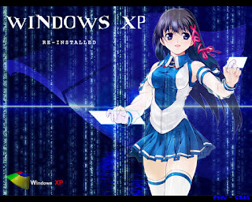

# Windows XP系统下仍可运行的软件最新版本

作为一名Windows XP的老用户，我决定整理一份最后仍能正常运行的软件清单。这份清单还在完善中，后续会不断更新。欢迎随时联系我们获取最新内容！:）

**以下所有软件均针对纯净版 Windows XP SP3**  开发。RTM/SP1/SP2 正式版尚未对这些软件进行测试。64 位软件的兼容性将单独标注，非官方的 KernelEx 与 XomPie 不在本次测试范围内。

**页面最后更新时间：2025年6月8日**

**符号：**

**CS** - 并发支持；接收更新和/或更高版本

**US** - 非官方支持

**FV** - 最终可用版本

**~$** - 免费增值

**&#36; &#36; &#36;** - 商业盗版软件（其他所有内容均为免费）

## 微软官方更新

DirectX 9c（最终可用版）

.NET Framework 4.0（最终正式版）

Silverlight 5.1.50918.0（最终正式版）

微软安全必备工具 4.4.304??（最终正式版）

Windows Live Essential 14.0.8117.416（**FV**）

## 非官方更新和内核扩展

由 Skulltrail192 开发的单核心 API/Xompie（[x86](https://www.adrive.com/public/SgS7rU/one-core-x86.rar)）（[x64](https://www.adrive.com/public/9qqqxN/one-core-x64.rar)）（**CS**）

[适用于Windows Server 2003的Shorthorn内核修改包](https://www.adrive.com/public/fj2nP7/WRK.rar) (**CS**)

[64GB 内存补丁](https://retrosystemsrevival.blogspot.com/2019/05/windows-xp-x86-64gb-ram-patch.html)（**FV**）- 一个来源不明的中文内存补丁。

[Diyba 制作的128GB内存补丁](https://retrosystemsrevival.blogspot.com/2018/01/windows-xp-ram-patch.html) (**FV**)- 如果你选择此补丁，请务必遵循所有说明！！

[Fix128 内存补丁](https://retrosystemsrevival.blogspot.com/2019/12/fix128-128gb-ram-patch.html)（**FV**）- 一款俄罗斯的物理地址扩展启用工具；可以说是目前最好的。

Daniel_K 开发的 PAE 补丁——让 Windows XP 能够在现代 ACPI 电脑上安装。

DirectX 10 - 我个人不建议使用非官方版本，它的兼容性非常有限。

***非官方补丁请自行承担风险！为防止 Windows XP 出现潜在的变砖情况，请备份你的数据！***

## 反恶意软件和防病毒软件

[Malwarebytes 3.5.1.2522](https://downloads.malwarebytes.com/file/mb3_legacy)（免费增值，**FV**，**CS**）- 仅接收定义库更新！

MalwareBytes 广告清理工具 6.047（免费增值，**FV**）

[Avast](https://www.avast.com/download-thank-you.php?product=FAV-2532-D&locale=en-ww)（**FV**；**CS**）- 仅接收病毒库更新！

ESET 终端防病毒软件 6.5.2132.5（**&#36; &#36; &#36;**，**FV**）

ESET 终端安全防护 6.5.2132.5（**&#36; &#36; &#36;**，**FV**）

ESET NOD32防病毒9.0.429.2（**&#36; &#36; &#36;**，**FV**）

ESET 智能安全 9.0.429.2（**&#36; &#36; &#36;**，**FV**）

## 音频编辑器

Audacity 2.2.3（**US**）- 由 nojus2001 移植的版本

Audacity 2.1.3（**FV**）

## CAD 软件

[SALOME 7.7.1](http://files.salome-platform.org/Salome/Salome7.7.1/SALOME-7.7.1-WIN32.exe)（**FV**）- 注：后续的 x64 版本未经过测试

## 聊天客户端

[Miranda NG 0.95.13](https://www.miranda-ng.org/distr/stable/miranda-ng-v0.95.13.exe)（**CS**）- 支持Discord！需要OpenSSL！

[Pidgin 2.14.1](https://www.pidgin.im/install/)（**CS**）

## 云存储与文件传输协议

FileZilla 3.9.0.1（**FV**，**US**）

FileZilla_Server 0.9.43（**FV**）

## 编解码器

[FFMpeg 4.3](https://rwijnsma.home.xs4all.nl/files/ffmpeg/?C=M;O=D)（**US**）- 非官方回溯移植版

K-Lite 解码包 15.4.1，2020年3月13日（**CS**）

## 编程语言

PHP 5.4.45（未知）

GrepWin 1.6.3（未知）

Python 3.4.4（**FV**）

Ruby 1.9.x（**FV**）

Erlang OTP 17.5（**FV**）

## 数据库

[MySQL 5.5.47](http://cdn.mysql.com//Downloads/MySQL-5.5/mysql-5.5.47-win32.zip)（**FV**）

PostgreSQL 9.3.x（**FV**）

MongoDB 2.0.x（**FV**）

Neo4J 2.3.8 - 支持 JDK 7 的最后版本（**FV**）

MariaDB 10.1.13（**FV**）

## 数字艺术软件

Adobe Photoshop CS6 系列（**&#36; &#36; &#36;**，**FV**）

[Apophysis 7x](http://iweb.dl.sourceforge.net/project/apophysis7x/Oldversions/Apophysis.7X15D.x86_amd64.zip) 2.10.15.3（**FV**）

ArtRage 4.0.6（**FV**）

Autodesk Maya 玛雅 2013（**FV**）

Autodesk 3DMax 2013（**FV**）

Autodesk TrueView 2014（**FV**）

Autodesk DesignReview 2013（**FV**）

Blender 2.76b（**FV**）

Clip Studio Paint 1.5.4（**&#36; &#36; &#36;**，**FV**）- [此处提供安装说明！](https://ask.clip-studio.com/en-US/detail?id=2027)

Drawpile 2.0.5.1（**FV**）

[FireAlpaca 2.4.5 便携版](https://firealpaca.com/download/win_zip)（**US**）

GIMP 2.8.14.1（**FV**）

Hornil StylePix 1.14.5（**FV**）

Inkscape 0.92.3（**FV**）

Krita 2.8.1.1（**FV**）

[NMap/ZenMap](https://nmap.org/dist/nmap-6.47-setup.exe) 6.47（**FV**）

PaintNET 3.5.11（**FV**）

PhotoFiltre Studio X（**&#36; &#36; &#36;**，**FV**）

[Trimble 8.0.16846](http://dl.trimble.com/sketchup/gsu8/FW-3-0-16846-EN.exe)（**FV**）

## 文档查看器（PDF 格式）

[Adobe Reader XI](ftp://ftp.adobe.com/pub/adobe/reader/win/11.x/11.0.00/en_US/AdbeRdr11000_en_US.exe)（11.0.23），2017年（**FV**）- 必须[手动更新](ftp://ftp.adobe.com/pub/adobe/reader/win/11.x/11.0.23/misc/AdbeRdrUpd11023.msp)才能使11.0.23版本正常运行！

FoxitReader 福昕阅读器 9.01（**FV**）

SumatraPDF 3.1.2（**FV**）

[SamatraPDF 3.3](https://mega.nz/file/bxo1CZIZ#GT68NQpPRd1vVyoss7heCxfB5194AA56ab880Lc9mRI)（**FV**、**US**）- 非官方回移植版本！不过书籍标签存在故障。

Universal Viewer 6.7.7（**&#36; &#36; &#36;**，**CS**）

## 下载工具

MediaHuman Youtube to MP3 3.9.9.51（**CS**）

XDM Xtreme Downloader（**CS**？）

## 驱动程序安装软件

SDI 快速驱动安装程序（**CS**）

~~驱动包解决方案~~ (**CS**)

## 电子邮件客户端

Foxmail 7.2.20（**CS**）- 中文电子邮件客户端；不得违反中国法律！

## 资源管理器外壳替换程序

Total Commander 9.51（**CS**）

## 防火墙

Sphinx Windows 10 Firewall Control [斯芬克斯Win 10防火墙控制 7.5](https://web.archive.org/web/20200125210029if_/https://www.sphinx-soft.com/download/W10FC7.5/Windows10FirewallControlPlUS-XP-Setup.exe) (**FV**)

## 文件归档软件

[7-Zip 25.00](https://www.7-zip.org/download.html)（**CS**）

WinRAR 5.71（**CS**）

## 文件恢复

[TestDisk 7.0](https://www.cgsecurity.org/Download_and_donate.php/testdisk-7.0.win.zip)（**FV**）

## 游戏开发

Unity 5.2.4 f1（**FV**）

## 集成开发环境

Qt 5.6.3（**~$**，**FV**）

Visual Studio 2010（**~$**，**FV**）

**注：Visual Studio 2013/2015/2017/2019 搭配特定工具集可面向 Windows XP 开发！**

Mono .NET 3.2.3（**FV**）

R-Studio（R 前端）0.99.441（**FV**，**US**）

R-Studio（R 前端）0.98.1103（**FV**）

PellesC 8.x（**FV**）

## IDE 编译器

[MATLAB Compiler Runtime 2015aSP1](http://www.mathworks.com/supportfiles/downloads/R2015a/deployment_files/R2015aSP1/installers/win32/MCR_R2015aSP1_win32_installer.exe) 8.5.1（**FV**）

## IDE 扩展

Node.JS 5.12（**FV**）

[NuGet 2.8.5](https://nuget.codeplex.com/downloads/get/1441483)（**FV**）

## 图片修改工具

FastStone Photo Resizer 照片调整器 4.3（**CS**）

## 图像查看器

FastStone 图像查看器 7.5（**CS**）

FastStone MaxView 3.3（**~$**，**CS**）

Honeyview 5.35（**CS**）

Irfranview 4.54（**CS**）- 插件也应该可以正常使用！;）

XnView 2.49.1（**~$**，**CS**）

## 隔离软件

Sandboxie 5.22（**FV**）

## 媒体转换器

[AIMP 3.60.1503](http://www.aimp.ru/?do=download&os=windows&cat=old)（**FV**）

[FormatFactory 格式工厂 4.3.0.0](https://formatfactory.en.uptodown.com/windows/download/1736029)（**FV**）

## 媒体播放器

苹果 Quicktime 7.7.9（2016年1月7日）（**FV**）

[iTunes 12.1.3.6](https://secure-appldnld.apple.com/itunes12/031-34002-20150916-98D32A92-5C11-11E5-80AC-C25A6DA99CB1/iTunesSetup.exe)，2015年（**FV**）

KMPlayer（**CS**）

Media Player Classic BE

MPC-BC 1.4.7（**US**）

MPC-HC 1.7.3（**FV**）

[Potplayer](https://www.videohelp.com/download/PotPlayerSetup-210209.exe) 210209（**FV**）

**Potplayer 可能需要 ffcodec.dll**

SMPlayer 17.3（**FV**）

[Spotify 1.0.20.101.ge6957e14](https://drive.google.com/file/d/17k5C7tcYBtZS6LR9y3_OKv-CXLUXBC0X/view?USp=sharing) (**FV**)

VLC播放器 3.0.11（**CS**）

XBMC（Kodi）12.3（**FV**）

## 手机连接功能

iTools v4.3.5.5（**FV**）- 支持 Windows XP 连接苹果设备！经测试，iOS 14.6 可在 iPad 4 上正常运行。

## 音乐流媒体

Spotify 1.0.20.101.ge6957e14（**~$**，**FV**）

## NPAPI插件

[Java JRE 8 Update 152](http://sdfox7.com/xp/sp3/EOL/jre-8u152-windows-i586.exe)（**FV**、**US**）- 更高版本可安装，但在纯净版 Windows XP 系统上无法运行！

OpenJDK 1.8.0_332-1（**US**）

Adobe Flash Player 32（**FV**）- 若安装原版 Adobe Flash Player，请勿安装最新版本，因其会自行失效！

[Clean Flash Player 纯净版 Flash 播放器 34.0.0.282](https://gitlab.com/cleanflash/installer/-/releases)（**CS**）

## 网络

Privatefirewall 7.0.30.2（**CS**）

Wireshark 1.12.13（**FV**）

## 办公套件

Apache OpenOffice 4.1.7（**CS**）

[LibreOffice 5.4.7.2](https://downloadarchive.documentfoundation.org/libreoffice/old/5.4.7.2/win/x86/) ([64位](https://downloadarchive.documentfoundation.org/libreoffice/old/5.4.7.2/win/x86_64/)) (**FV**)

Microsoft Office 2010（**~$**，**FV**，**CS**）- 若进行更新，请勿安装KB4484126和KB4461522！这两个更新会导致Word无法启动！若已安装，请卸载这些更新！

[OnlyOffice 7.4.0](https://www.onlyoffice.com/download-desktop.aspx?from=desktop)（**CS**）

[SoftMaker FreeOffice 2018 修订版 976.0314](https://www.softpedia.com/get/Office-tools/Office-suites/SoftMaker-FreeOffice.shtml) (**FV**)

[Softmaker Office 2016 修订版 768.1215 正式版](http://www.softmaker.net/down/ofw2016.exe) (**~$**，**FV**)

[WPS Office Free 2019 11.2.0.9281](https://retrosystemsrevival.blogspot.com/2020/08/wps-office-11209281-xp.html)（**FV**）——最后一个能启动并读取文件的版本。稍新的版本可能会安装，但无法正确读取文件或正常运行。最新版本（截至2020年7月）可通过将现有wpsmain.dll替换为11.2.0.9281版本的wpsmain.dll来正常运行；或者，xompie可解决该问题。

## 资源提取

Resource Hacker 4.0.0（**FV**）

## 屏幕捕获

[Auto Screen Capture 自动屏幕截图](https://github.com/UCyborg/autoscreen/releases/tag/2.1.5) 2.1.5（**FV**；**US**）- 需安装 .NET Framework 4.0。

[FastStone Capture 9.3](https://retrosystemsrevival.blogspot.com/2019/02/faststone-screen-capture-53.html)（**~$**，**FV**）

## 屏幕保护程序

[Windows Vista 屏幕保护程序](https://retrosystemsrevival.blogspot.com/2020/08/windows-vista-screensavers-for.html) - 甚至可在 Windows ME 电脑上运行！

## 屏幕录制器

CamStudio 2.7.4 - 未经测试

DVDVideoSoft 免费屏幕视频录制器 3.0.50.708（**CS**）

Fraps 3.5.99（**FV**）- 废弃软件

[NextPVR 4.0.4](http://www.nextpvr.com/NPVRSetup_4_0_4_171121.exe)，2017年7月23日（**FV**）

## 安全

增强缓解体验工具包 5.2版（维基百科记载为 4.1版）（**FV**）

## 社交媒体客户端

gajim 0.16.9

[Telegram 电报 1.8.15](http://i430vx.net/files/XP/EOL/tsetup.1.8.15.exe)（**FV**）

Teamspeak 客户端 3.0.19.4（**FV**）

遗憾的是，Discord 客户端无法在 Windows XP 系统上联网。

## 系统分析器

CPU-Z 1.9.1（**CS**）

gpu-z 2.28（**CS**）

CoreTemp32（**~$**，**CS**）

## 系统工具

BleachBit 2.2（**FV**）

[CCleaner 5.64 标准版](https://download.ccleaner.com/cCSetup563.exe)/便携版/精简版/专业版/技术版/商业版(32位)/商业版(32位 MSI)/商业版(64位 MSI)/（**FV**）

Intel Solid-State Drive Toolbox 英特尔固态硬盘工具箱 3.3.7（**FV**）

[Process Explorer 16.2](https://technet.microsoft.com/en-US/sysinternals/processexplorer)（**FV**）——显然由于存在报告值错误的问题，使用 16.12 版本会更好。

ThrottleStop 8.60（**FV**）

[Treesize Free 磁盘空间清理工具免费版 3.4.5](http://www.filehorse.com/download-treesize-free/24574/)（**FV**）

## 文本转语音软件

SAPI 5 微软 Sam、Mary 和 Mike（**FV**）

Microsoft Anna XP（**FV**）

AT&T Natural Voices 自然语音（未知）

## 视频编辑软件

VideoPad视频编辑器（**~$**，**CS**）

VSDC 免费视频编辑器6.4.2（**FV**）

## 游戏引擎

Spring Engine 104.0.1-409-g07c2800（**FV**）

更多信息可查看[此处](https://msfn.org/board/topic/176299-latest-version-of-software-running-on-xp/page/19/)。

## 虚拟化/模拟软件

VirtualBox 5.2.22（**FV**）- 仅兼容 Windows XP x64 版本！

VirtualBox 5.2（**FV**）

VMware Player 6.0.4（**FV**）

VMware Workstation 10.0.7（**&#36; &#36; &#36;**，**FV**）

EPSXE 2.0.0（**FV**）

[Epsxe 2.0.5](https://retrosystemsrevival.blogspot.com/2020/12/epsxe-205-xp.html)（**US**）

[PCSX2 1.6.0](https://github.com/blueclouds8666/pCSx2_XP)（**US**）

**即使使用非官方的 DirectX 10 补丁，PCSX2 在 Windows XP 系统上也无法使用 DirectX 10 或更高版本！**

Project64 v2.4.0-425-g（**CS**）

RetroArch XP

Mednafen 1.25.0（**CS**）

higan（**CS**）- 未测试

NO$GBA 3.1（**CS**）- 未经测试

[MESSUI 0.234](https://www.progettosnaps.net/messui/)（**CS**）

[MAMEUI 0.234](https://www.progettosnaps.net/mameui/)（**CS**）

## 语音合成器

Utau 0.4.18e（**CS**）——自2013年起未再更新，但依然非常受欢迎。

VOCALOID（**FV**）

VOCALOID2（**FV**）

VOCALOID3（**FV**）- 检查每一款VOCALOID！部分可能不兼容Windows XP！

**乐正绫、心华、千花以及其他几款仅支持 Windows 7 及更高版本系统！**

## 网页浏览器

***重要提示：不支持 TLS 1.2 的网页浏览器已无法访问大多数网站！请确保您的网页浏览器支持 TLS 1.2！***

**此外，获取[证书更新](https://retrosystemsrevival.blogspot.com/2021/03/certificate-updates-for-windows.html)！！网站会因没有这些更新而屏蔽网页浏览器！**

### 基于 Chromium 内核的

[Supermium 浏览器 132](https://github.com/win32ss/supermium/releases) (**CS**)

[高级 Chromium 54](https://retrosystemsrevival.blogspot.com/2018/01/advanced-chrome-542065300.html) (**FV**)

Google Chrome 49 版（**FV**）

[Mini Bink/Mini Chrome](https://browser.kfsafe.cn/)（Chromium 86）（**CS**）

[DC 浏览器 4.0.3.6](https://archive.org/download/360EE_Modified_Version/DCB_4.0.7.22_Modified.7z)（Chromium 75）（**FV**）- 少数支持西方扩展程序的中文网页浏览器之一。

[360极速浏览器 13](https://retrosystemsrevival.blogspot.com/2019/05/360-extreme-chrome-browser.html)（Chromium 86）（**FV**）- 11.0.2251.0版本因性能更优，建议优先使用，暂未测试13版本。

[360安全浏览器 12.1.2428.0](https://retrosystemsrevival.blogspot.com/2019/08/360-secure-browser.html)（Chromium 78）（**FV**）- 该网页浏览器仅支持中文！

[傲游云浏览器 5.3.8.2000](https://www.maxthon.com/)（Chromium 69），2019年10月25日（**FV**）

猎豹浏览器6/CM浏览器（**FV**）

[搜狗浏览器 8](https://blogger.googleUSercontent.com/img/b/R29vZ2xl/AVvXsEiaZKOkekukvD13HI_mHTUnkhZLlQqKBd9aHVYH6UkqD_vCthanDajnMuZnEMdxFJ7JoK2ckhJQT2PtHzC4i76Mbd8dmKU0CYf1MUxBD_IRJDkYW01KrQZE8HRTQAyEEhIQcK1bInyuPLM/s1600/PlanetME.gif)（**CS**）——Windows XP系统上的Chromium 86内核版本！后续会更新该页面信息。

[UC浏览器](https://mega.nz/#!O55XDKIa!Ro5_yzi_9sTYr7RykuLAO88A7oaOftraeOidssj0zjo) 7.0.185.1002（Chromium 55）-（**FV**）

[Coc Coc 浏览器](https://mega.nz/#!W4wxHSaS!LLhKL7IhJf4M2tymPq303orW5kt_vPci7NvbFdgTWgY)（Chromium 55？）（**FV**）

腾讯QQ浏览器（Chromium 53；使用Vista系统则为Chromium 70）

[闪捷浏览器 10.0.13.0](https://www.slimjet.com/en/dlpage_xp.php)，2017年2月（基于Chromium 50）（**FV**）

Chedot 51（**FV**）

Citrio 浏览器 50.0.2661.276（**FV**）

Opera 36（**FV**）

百度星火浏览器 43.23.1007.94，2017年2月24日（**FV**）

**中国的网页浏览器会将数据传回中国；不要在网上做任何违反中国法律的行为。**

### 基于Mozilla内核的

[MyPal 68](https://github.com/Feodor2/Mypal68/releases)（**CS**）

Firefox 52 扩展支持版本（**FV**）

Firefox 54 扩展支持版

SeaMonkey 2.49.5（**FV**）

### 基于 Goanna 内核——最新版本请访问[Roytam1 的网站](https://rtfreesoft.blogspot.com/search/label/browser)
[MyPal](https://github.com/Feodor2/Mypal/releases) 29.3.0（**FV**）

Palemoon 月光浏览器 28（**CS**）- Roytam1 定制版

Palemoon 月光浏览器 27（**CS**）- Roytam1 定制版

Serpant（**CS**）- Roytam1 定制版

BOC（**CS**）- Roytam1 制作的版本

K-Meleon 76.2G（**CS**）- Roytam1 制作的版本

ArtistScope 网页浏览器 28.7.2，2020年8月6日（**CS**）

AOL 安全盾浏览器（**FV**）

### 基于 Qt 开发的

[Otter 水獭浏览器 1.0.03](https://sourceforge.net/projects/otter-browser/files/otter-browser-1.0.03/otter-browser-win32-1.0.03-xp.zip/download) (**FV**)

QupZilla 1.8.9，2015年11月（**FV**）

**2.0.1 版本非官方使用时会出现错误。**

### 渲染引擎未知的

[Nano 浏览器](https://mega.nz/file/L8IhDaoC#XHO2Sf6_fpK-Kk43oZQZwYUAWFNiieeN0Kt2zm2_nVI)，2017年（**CS**？）

## 网页扩展

[uBlockO 旧版](https://github.com/gorhill/uBlock/blob/master/dist/README.md#firefox-legacy)（**CS**）- 适用于基于 Mozilla 的网页浏览器和旧版 Firefox 浏览器；与 Roytam1 的网页浏览器配合使用效果良好。

## Windows 自定义

[Rainmeter 3.3.3](https://builds.rainmeter.net/Rainmeter-3.3.3.exe) (**FV**)

## Windows 补丁工具

[PatchPE 1.30](https://www.di-mgt.com.au/hexdump-for-windows.html)（**FV**）

## BT客户端

[qBittorrent 4.1.9.1](https://sourceforge.net/projects/qbittorrent/files/qbittorrent-win32/qbittorrent-4.1.9.1/)（**FV**）

比特彗星 1.79（**CS**）

**uTorrent 3.5.5 无法在 Windows XP 上运行**

## 游戏

[GZDoom 4.1.2b](https://zdoom.org/files/gzdoom/)

## 其他

[谷歌地球 7.1.8.3036](https://dl.google.com/earth/client/GE7/release_7_1_8/googleearth-win-7.1.8.3036.exe)（**FV**）

Sigcheck 2.30（**FV**）

adb 1.0.32（**FV**）

[Adobe DNG 转换器 8.3](http://download.adobe.com/pub/adobe/dng/win/DNGConverter_8_3.exe)（**FV**）

DB2（客户端）10.1（**FV**）

Oracle Instant Client 11.2（**FV**）

Elastic Search 2.4.x（*beat 用 1.3.x 版本，kibana 4.6 用 1.3.x 版本）（**FV**）

文件定位器专业版 7.5 内部版本 2114（**&#36; &#36; &#36;**）

Pop Peeper 5（**CS**）

## 待测试

ALLPlayer（未知）

MPlayer，2019年9月28日（未知）

Sketchbook 7.0.5

列表最后更新于2021年11月27日。
